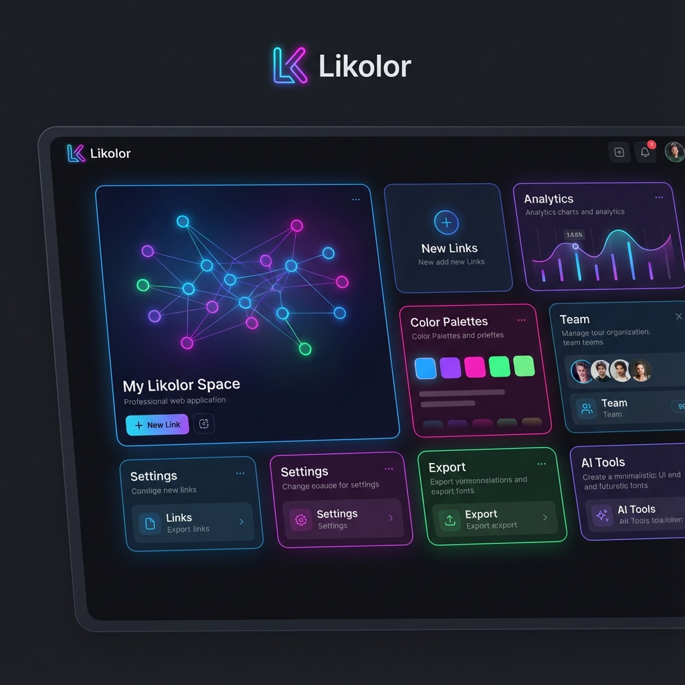

# 🌈 Likolor


### Tu colección de enlaces, reinventada.

**Likolor** es una aplicación web progresiva (PWA) diseñada para aquellos que necesitan organizar su vida digital con estilo. Olvídate de los marcadores aburridos y desorganizados del navegador; con Likolor, tus enlaces cobran vida en una interfaz moderna, colorida y altamente funcional.

---

## ✨ Características Principales



- **🎨 Diseño Bento Grid**: Una interfaz visualmente impresionante basada en el estilo Bento, que organiza tus enlaces de forma limpia y atractiva.
- **📱 Experiencia PWA**: Instala la aplicación en tu móvil u ordenador y accede a tus enlaces como si fuera una app nativa, incluso sin conexión.
- **🔍 Extracción de Metadatos**: Simplemente pega un enlace y Likolor extraerá automáticamente el título, la descripción y una imagen de vista previa.
- **🏷️ Categorización Inteligente**: Organiza tus enlaces por categorías personalizadas para encontrarlos en segundos.
- **⚡ Rendimiento de Próxima Generación**: Construido con **Angular v20**, aprovechando Signals para una reactividad instantánea y fluida.
- **🔥 Sincronización en Tiempo Real**: Gracias a **Firebase Firestore**, tus enlaces están seguros y sincronizados en todos tus dispositivos.

---

## 🛠️ Stack Tecnológico

Likolor utiliza las herramientas más modernas del ecosistema web:

- **Framework**: [Angular v20](https://angular.dev/) (Zoneless, Signals)
- **Estilos**: [Tailwind CSS v4](https://tailwindcss.com/)
- **Backend**: [Firebase](https://firebase.google.com/) (Firestore & Auth)
- **PWA**: Angular Service Worker
- **Testing**: Vitest

---

## 🚀 Comenzando

### Requisitos previos

- Node.js (v18 o superior)
- npm o yarn

### Instalación

1. Clona el repositorio:

   ```bash
   git clone https://github.com/tu-usuario/likolor.git
   cd likolor
   ```

2. Instala las dependencias:

   ```bash
   npm install
   ```

3. Inicia el servidor de desarrollo:

   ```bash
   npm start
   ```

4. Abre tu navegador en `http://localhost:4200` y ¡disfruta!

---

## 📄 Licencia

Este proyecto está bajo la licencia MIT. Siéntete libre de usarlo, modificarlo y compartirlo.

---

Desarrollado con ❤️ por [Coler8 SP](https://github.com/Coler8)
